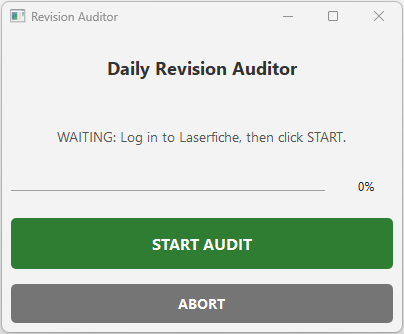

# RevisionAuditor

A standalone, Python-based desktop automation tool for tracking document revisions in manufacturing workflows. It audits Excel-based document lists against a Laserfiche web database to automatically detect updated or missing files.

It replaces legacy VBA macros with a robust Playwright automation engine, wrapped in a modern PyQt6 floating dashboard. It is designed to run daily audits for multiple product lines simultaneously.

## 📸 Preview


## ✨ Features
* **🤖 Automated Web Scanning:** Uses a headless Chromium browser to rapidly check hyperlinks and detect "Entry Not Found" or "404" errors.
* **🖥️ Floating Dashboard:** A compact, "Always-on-Top" control panel allows users to start or abort audits without losing focus.
* **📊 Batch Processing:** Audits multiple product lines (Kinnex and Quattro) in a single session with a single login.
* **📑 Smart Reporting:**
    * **Highlighting:** Automatically highlights dead links in Yellow.
    * **Cleanup:** Removes clickable hyperlinks and resets text formatting for a clean report.
    * **Timestamping:** Stamps the exact date and time of the audit.
* **🛡️ Safe & Robust:** Features an immediate "Kill Switch" and protects browser binaries in a hidden system folder.

## 🛠️ Tech Stack
* **Language:** Python 3.13+
* **Automation:** Playwright (Browser Engine)
* **GUI:** PyQt6 (Floating Dashboard)
* **Data:** OpenPyXL (Excel Read/Write)
* **Build:** PyInstaller (Compiled to standalone .exe)

## 🚀 Installation & Build
Because this app relies on a specific browser engine and local Excel files, it must be built correctly to run on other machines.

### 1. Prerequisites
```bash
pip install playwright PyQt6 openpyxl pyinstaller
playwright install chromium
```

### 2. Building the Executable
To compile the app into a standalone .exe:
```bash
pyinstaller --noconfirm --onefile --noconsole --name "RevisionAuditor" --clean "audit_gui.py"
```

## 📂 Deployment Structure
For the application to function correctly, the folder structure must be maintained:
* `RevisionAuditor.exe` (The compiled app)
* `Kinnex Revision Source.xlsx` (Input data)
* `Quattro Revision Source.xlsx` (Input data)
* `_sys_core/` (Contains Chromium browser binaries)

## 👤 Author
**Jason Sparks** - [GitHub Profile](https://github.com/webdev-jason)

## 📄 License
This project is licensed under the MIT License - see the [LICENSE](LICENSE) file for details.